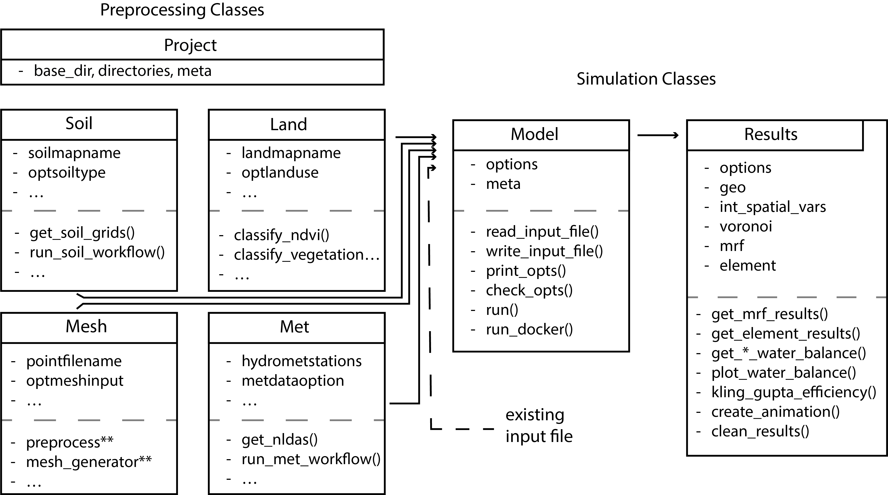

.. pytRIBS documentation master file

pytRIBS
=======
**pytRIBS** is a pre-to-post processing python package designed to allow users to setup, simulate, and analyze TIN-based
Real-time Integrated Basin Simulator (tRIBS) model runs through a python interface. For new tRIBS users see the tRIBS
`documentation <https://tribshms.readthedocs.io/en/latest/>`_ for more information.

**pytRIBS** has a modular design mirroring the structure of a tRIBS model simulation as demonstrated by the Figure 1.

   Figure 1: High-level design of the pytRIBS package, showing the key components and their interactions.

The core of **pytRIBS** involves five preprocessing classes (Project, Soil, Land, Mesh, and Met) and two Simulation
classes (Model and Results) that manage setup, execution, and post-processing of a tRIBS model simulation. Each of these
major classes draw from a set of base classes. You can read about the underlying functionality of each class in the :ref:`API Documentation` section.

Note: this packages is currently under development and is subject to further changes.

.. toctree::
   :maxdepth: 2
   :caption: API Documentation:

   classes

Indices and tables
==================

* :ref:`genindex`
* :ref:`modindex`
* :ref:`search`
